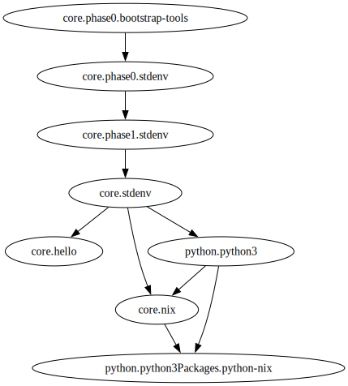

# auxolotl-poc

This repository is a proof-of-concept for one way of splitting `nixpkgs` into multiple repositories.
It's very minimal, hacky in some places, and only meant as an exploration.

## Problem

Currently, `nixpkgs` contains >100,000 packages in a single git repository. This results in:

  - A ~35MiB tarball download to use any one of those packages
  - An ~4GiB git clone in order to work on it locally
  - A heavy amount of issues & PRs, which then requires...
  - Special tooling to label and manage issues effectively
  - Lots of rebasing and cherry-picking

We want to build an alternative solution, which addresses these problems by:

  - Splitting package management across multiple teams & repositories, to make managing issues and PRs easier
  - Not every contributor needing to clone a massive repository, making it more approachable
  - End-users to only download parts of the package repository that they need

## Design

This repository is loosely based on the design proposed by Jeff Hykin [here](https://forum.aux.computer/t/sig-repos-how-should-they-work/416/34).

In practice, it would be implemented as multiple repositories. To make things easier to change & review, these are just different folders in one repository for now.

Our proof-of-concept has these repositories:

  - `lib` - pure, system-agnostic helper functions that don't depend on anything. mostly from [auxolotl/lib](https://github.com/auxolotl/lib)
  - `core` - minimal set of packages considered vital for everything else. currently, just `stdenv` stuff.
  - `python`, ... - sig repositories, containing more packages.
  - `registry` - generated nix code, which pulls in `core` and sig repos and wires them all together.
  - `resolver` - code to generate the `registry`

As a demo, we 'provide' the following package tree, where the first part of the package name is just the flake that it comes from.
Note that `core` and `python` depend on packages from each other: this is what we want to be able to deal with.



There isn't really code to build these packages right now: all we're focused on here is dealing with the dependencies, so it would only be a distraction.
For similar reasons, we only have 2 phases of bootstrapping rather than the actual 6.

### Writing packages

Actual package code goes in `core` or one of the sig repos, using the [`by-name` convention](https://github.com/NixOS/nixpkgs/blob/master/pkgs/by-name/README.md). In practice, some packages might need more complex code (particularly stdenv/bootstrapping stuff).

For packages, we expect the same `callPackage` style that `nixpkgs` uses: A lambda which destructures the dependencies it needs from its argument, and ignores everything else.

For example, `hello` as defined in `core/by-name/he/hello/default.nix`:

```nix
{ stdenv, fetchurl, ... }:
stdenv.mkDerivation rec {
  pname = "hello";
  version = "2.12.1";

  src = fetchurl {
    url = "mirror://gnu/hello/hello-${version}.tar.gz";
    sha256 = "sha256-jZkUKv2SV28wsM18tCqNxoCZmLxdYH2Idh9RLibH2yA=";
  };
}
```

If we depend on a child attribute, not the top-level one, then we provide a default for our argument that shows the structure it should have. For example, `phase1.stdenv` depends on `phase0.stdenv` like so:

```nix
phase1.stdenv = { phase0 ? {stdenv = {};} , ...}: throw "todo";
```

Note that there are no flake dependencies between `core`, `python`, etc.
This allows the dependencies between repositories to have cycles (core using packages from python, python using packages from core) so long as actual package dependencies aren't circular.

### Wiring them up

Packages using `by-name` automatically get included in our structure. However, unlike nixpkgs, **package repositories don't actually export derivations**.

Instead, each repo's flake exports an attribute set `lambdas`, which tells us where all the `callPackage`-like functions are. Here is a part of `core`'s:

```
{ gcc = «lambda gcc @ /nix/store/vacxqqqrj91v0pvqfc958iwj9vdbrzr6-stdenv/packages.nix:9:9»; hello = «lambda @ /nix/store/dilix64xmrny6p4z2z55bawcxxclc09q-source/core/by-name/he/hello/default.nix:1:1»; ... }
```

In practice, these probably need to be parameterised by `system`: This is ignored here for simplicity and everything uses `x86_64-linux`.

`registry` is where these packages are actually made available.

Firstly, it re-exports each repository's `lambdas`:

```
registry/ $ nix eval .#lambdas
{ core = { ... }; python = { ... }; }
```

`resolver` evaluates this attribute and

  1. Creates a mapping from package attribute name to lambda location. ie `hello` -> `core/by-name/he/hello/default.nix:1:1` (`resolver/src/locator.rs`)
  2. Parses each lambda to figure out that package's dependencies, and builds a dependency graph from that. (`resolver/src/build_graph.rs`)
  3. Topologically sort the dependency graph, to divide the package hierarchy into 'levels'. (`resolver/src/deps.rs`)
  4. Generates `registry/pkgs.nix`.

`pkgs.nix` ends up like this:

```nix
# All of the flakes we're reading packages from
{ core, extra, ... }:
let
  # Packages with no dependencies
  lvl0 = { } // {
    phase0.bootstrap-tools = core.phase0.bootstrap-tools { };
  };

  # Packages depending on things in lvl0
  lvl1 = lvl0 // {
    phase0.stdenv = core.phase0.stdenv { phase0.bootstrap-tools = lvl6.phase0.bootstrap-tools; };
  };

  # ...

  # Packages depending on things from lvl5 to lvl0
  lvl6 = lvl5 // {
    python3Packages.python-nix = python.python3Packages.python-nix {
      nix = lvl6.nix;
      python3 = lvl6.python3;
    };
  };
in
lvl6
```

We also render our dependency graph with graphviz and put it in `registry/pkgs.svg`.

You can try this out by running `./scripts/update-registry.sh`.

## Summary

  - Repositories don't directly depend on each other
  - Each repository outputs an attribute set of callPackage-style lambdas
  - We infer each package's dependencies by parsing those lambdas, and wire everything up in `registry` (ensuring there are no circular dependencies)

Pros:

  - Multiple repositories, which should make swapping things out easier
  - `callPackage` style is familiar, allows easier porting from `nixpkgs`
  - Dependencies between packages are statically declared, allowing for easy analysis
  - ...?

Cons:

  - Another tool provides more maintenance burden
  - Local setup is more complex, especially if working on multiple repositories
  - Resolver is pretty hacky, may break with different nix versions
  - Flakes don't provide lazy loading of only parts of the package tree. This could be solved in a non-flake environment using IFD.
  - ...?

### Open questions

#### Overlays

Some suggestions [here](https://forum.aux.computer/t/sig-repos-how-should-they-work/416/58)

#### Versioning across repositories

If we intend to provide point releases then those need to be synchronised across all of the repositories, which seems complex.

A PR to one repository may affect building of packages in other ones, which we need some way to deal with.

Similarly, some PRs will end up needing to be spread across multiple repositories - how can we deal with this?

#### Tools for working with single repository locally

Since packages discard everything besides the dependencies they need, you could simply call the package with the entire registry, essentially doing what `nixpkgs` does.

However, this will be more complicated for adding packages / changing package dependencies.

Possibly users could just have their local versions as overlays on top of the current version (see above).
